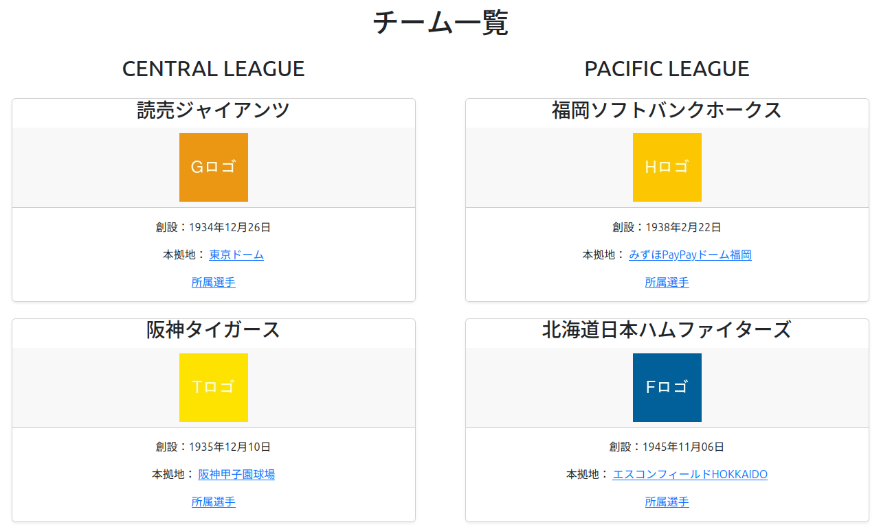
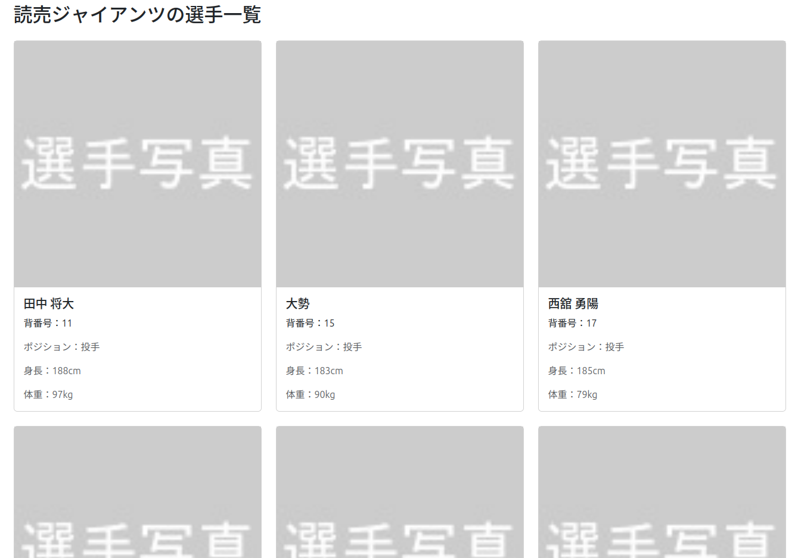

# 学習用 Laravel プロジェクト

このリポジトリは、Laravel学習用のものでMVCの流れやルーティング機能の勉強に使用しています。  
日本プロ野球12球団の所属選手の情報を管理できるアプリになっています。

## 一覧画面
 

## 現状の機能
- チームと選手の一覧をBootstrapを用いたBladeで表示 
- チームのロゴと選手の写真は、著作権の関係でdummyを使用
- Seederにて選手の追加、削除が可能（追加は各チームごとにcsvファイルを使用）

##　使用技術
- PHP 8.3
- Laravel 11
- MySQL 8.0
- Bootstrap 5